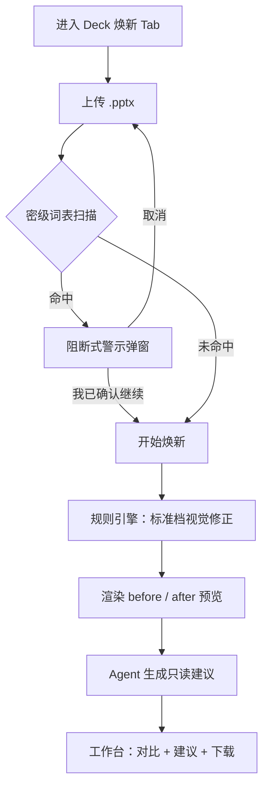

# Deck 焕新 — 产品需求文档（PRD）

| 字段 | 内容 |
|---|---|
| **文档版本** | v0.2（独立分支 `cursor/deck-refresh-scaffold-cc52`） |
| **状态** | 实施中 — Draft PR，验证后再 merge |
| **产品** | ST Deck Agent |
| **模块** | Deck 焕新（新增 Tab，与「Deck 生成」并列） |
| **原则** | **不修改、不重构**现有 Deck 生成链路；焕新为**增量能力**，独立入口、独立会话与 API |

---

## 1. 背景与目标

### 1.1 背景

当前 **Deck 生成** 面向「从需求/参考文档从零产出 ST 品牌合规 PPT」。内部用户常见另一类场景：**已有自制或外采 PPT，内容已定稿**，仅需在 **布局、设计、视觉** 上对齐 ST 品牌规范（色板、字号、对比度、对齐、对称等），且 **不希望 AI 改动文案与数据**。

### 1.2 产品目标

- 提供 **Deck 焕新** Tab：用户上传自有 `.pptx`，获得 **视觉标准化** 后的文件。
- **不删页、不调序、不增页**（含 **不自动追加 closing / trademark 页**）。
- **不修改任何文字、数字、图表数据**；内容相关反馈仅以 **只读建议** 展示。
- 提供 **逐页前后预览对比**，建立信任。
- 上传时进行 **密级/保密标识扫描**；命中固定词表时 **阻断式警示**，由用户确认是否继续。
- 第一版焕新强度为 **「标准」档**（见 §5），采用 **规则自动修正 + Agent 只读建议**。

### 1.3 非目标（Out of Scope — v1）

| 非目标 | 说明 |
|---|---|
| 改写、润色、翻译正文 | 不属于焕新；最多在建议面板提示 |
| 删页、调序、合并、拆分 | 明确禁止 |
| 追加 closing / 商标页 | 明确禁止（即使用户 deck 缺页） |
| 替换 SmartArt、重建复杂图表 | v1 标记为「跳过」，仅建议人工处理 |
| 替代 Deck 生成 | 两 Tab 并列，不合并流程 |
| 重构现有 `runner.py` / 生成 Prompt | 焕新独立模块与接口 |

---

## 2. 用户与场景

### 2.1 目标用户

- ST 内部需对外/对内汇报的员工  
- 已有 PPT 初稿，需快速 **品牌合规焕新** 的 IM&C、市场、产品线同事  

### 2.2 典型场景

1. **汇报前最后一遍**：多页 deck 色不统一、对齐混乱，需批量视觉整理。  
2. **非 ST 模板起步**：从旧模板或 WPS 导出，需对齐 `Presentation template.potx` 视觉参数。  
3. **合规自检**：上传前未注意页脚含「CONFIDENTIAL」，系统警示后用户自行判断是否继续。  

---

## 3. 产品结构（与现有架构关系）

### 3.1 信息架构

```
ST Deck Agent（单页 Web App）
├── Tab：Deck 生成          ← 现有能力，行为不变
└── Tab：Deck 焕新          ← 新增，见本文档
```

- **Tab 切换** 不共享左侧表单状态（需求框、页数选择等仅属于「生成」Tab）。  
- **工作台** 可复用同一 DOM 区域，但焕新使用 **独立状态机**（见 §6.2）。  
- **鉴权、限流、conduct 弹窗、语言切换** 与现网一致，全局生效。

### 3.2 架构约束（实现时必须遵守）

| 约束 | 说明 |
|---|---|
| **增量交付** | 新增 `refresh` 相关路由、runner 子模块或独立文件；**不改动** `/generate`、`/edit`、`/chat/*` 语义 |
| **会话隔离** | 焕新会话 workspace 与生成会话 **目录/前缀可区分**（如 `refresh-{sid}` 或 metadata 标记 `mode=refresh`） |
| **模板** | 焕新 **不复制** `workspace_template` 用于从零 build；仅上传用户 pptx + 焕新脚本/规则输出 |
| **依赖** | 复用现有预览链（LibreOffice + poppler）、`st_brand` 色板/字号常量；**不强制**用户 deck 走 `build.py` 生成路径 |

---

## 4. 用户流程（Deck 焕新 Tab）

### 4.1 主流程



### 4.2 焕新前确认（Tab 内常驻说明）

展示三条承诺（与 conduct 弹窗互补，非替代）：

1. **不删页、不调序、不增页**（含不添加 closing 页）。  
2. **不修改幻灯片中的任何文字与数据**。  
3. 焕新仅调整 **颜色、字体样式、形状位置与尺寸、对齐与对称** 等视觉属性。

### 4.3 密级警示弹窗（命中词表时）

- **触发时机**：文件上传校验通过后、开始焕新处理 **之前**。  
- **级别**：高于普通 conduct 提示的 **阻断式** modal。  
- **按钮**：`取消`（清空本次上传 / 返回上传区）、`我已确认有权处理并继续`（单次有效，**不**写入长期 sessionStorage）。  
- **文案要点**：检测到可能含保密/限级标识；工具仅辅助识别；用户须确认已脱敏且有权使用本工具；**继续处理责任由用户承担**（与使用须知第 3 条 AI 合规培训声明一致）。

---

## 5. 第一版焕新范围 —「标准」档

「标准」= 在 **不改字、不删不调序不增页** 前提下，自动执行下列 **规则层** 修正；无法安全自动处理的项进入 **跳过清单** 或 **只读建议**。

### 5.1 自动修正（规则引擎）

| 类别 | 标准档行为 | 依据 |
|---|---|---|
| **品牌色** | 将非 ST 主色大面积填充替换为 ST 色板允许色（Dark Blue / Yellow / Light Blue / 灰阶 / 深蓝 ramp）；单页颜色收敛至 **≤3 种**（尽力而为，冲突时保留并记入报告） | `brand-spec.md`、`st_brand.py` |
| **对比度** | 黄底强制深蓝字；深底白字；灰底深蓝字；修正明显违规组合 | `text_on()` 规则 |
| **字号** | 按元素角色对齐母版常量（标题 36 regular、信息条 20 bold、正文 14、页脚/轴标 11 等）；**仅改 `font.size` / `bold`，不改文本** | `Presentation template.potx` / `st_brand.py` |
| **字体** | 统一为 Arial；block 图内允许 Arial Narrow；移除明显非 Arial 的正文字体 | 品牌规范 |
| **对齐** | 同页标题、信息条、并列文本框/色块：左/右/顶/底/水平中心对齐（阈值：偏差 &lt; 0.05 in 不强制） | 布局规则 |
| **对称** | 两栏/三栏：列宽相等、列间距相等、顶部对齐；成对色块左右边距镜像 | 标准档核心 |
| **间距节奏** | 并列元素间距规整为模板常用档位（如 0.12–0.14 in 量级）；消除明显重叠 | 布局规则 |
| **Autofit** | 关闭 shape 文本 autofit，改为固定框（与 ST「禁止 autofit」一致） | SKILL / layout-rules |
| **图片** | 锁定纵横比；修正明显拉伸（仅缩放/位移，不替换图片内容） | 品牌规范 |
| **线条/形状** | 统一同类矩形线宽、去多余边框（在可识别为装饰/容器时） | 视觉一致性 |

### 5.2 不自动修正、仅报告 / Agent 建议

| 类别 | 处理方式 |
|---|---|
| 正文措辞、bullet 数量、叙事逻辑 | **只读建议**，不写入 pptx |
| SmartArt、OLE 图表、嵌入 Excel | **跳过** + 页级黄标「需人工」 |
| 动画、切换、备注页 | v1 **不处理** |
| 需增删页才能改善的版式 | 建议中说明；**不自动执行** |
| closing / trademark 缺失 | 建议中可提示外发规范；**不自动加页** |

### 5.3 标准档上限说明（对用户可见）

- 标准档 **不保证** 将任意第三方 PPT 变为「设计师手工级」；保证的是 **ST 品牌视觉基线 + 对齐/对称明显改善**。  
- 处理失败或跳过的页/形状在 **焕新报告** 中列出。

---

## 6. 功能需求

### 6.1 Tab：Deck 焕新 — 输入区

| ID | 需求 | 优先级 |
|---|---|---|
| R-UI-01 | 独立 Tab「Deck 焕新」，与「Deck 生成」并列 | P0 |
| R-UI-02 | 上传区：仅接受 `.pptx`，单文件；大小/页数限制与现网配置对齐或可单独配置 | P0 |
| R-UI-03 | 展示三条承诺（§4.2） | P0 |
| R-UI-04 | 可选：焕新范围默认 **全部页**（v1 不支持选页，简化实现） | P0 |
| R-UI-05 | 「开始焕新」主按钮；处理中可停止（同生成 Tab 停止语义） | P0 |

### 6.2 Tab：Deck 焕新 — 工作台状态机

| 状态 | 用户可见 |
|---|---|
| 待命 | 说明焕新能力与限制 |
| 扫描中 | 密级词表检测 |
| 警示待确认 | 密级 modal |
| 焕新中 | 进度（扫描页数 / 规则处理 / 渲染预览 / 生成建议） |
| 完成 | 前后对比 + 建议 + 下载 |
| 出错 | 友好错误，不泄露内部路径 |

**与 Deck 生成工作台分离**：焕新不展示「四步生成」文案；使用「扫描 → 焕新 → 对比 → 建议」四步说明（仅 UI 文案，非 Agent 流程）。

### 6.3 前后预览对比

| ID | 需求 | 优先级 |
|---|---|---|
| R-PV-01 | 每页生成 `before` 与 `after` 预览图（PNG） | P0 |
| R-PV-02 | 缩略图列表：左 before / 右 after 并排 | P0 |
| R-PV-03 | 点击单页可放大；支持左右切换或滑块对比（二选一，v1 至少一种） | P1 |
| R-PV-04 | 页级 **变更摘要**：如「对齐 3 处 · 配色 2 处 · 字号 5 处」（来自规则 diff 日志） | P1 |

### 6.4 只读建议（Agent）

| ID | 需求 | 优先级 |
|---|---|---|
| R-AG-01 | 焕新完成后，Agent 阅读 before/after 预览 + 规则报告，输出 **Markdown 建议面板** | P0 |
| R-AG-02 | 建议可含：拥挤度、版式选型、汇报节奏、跨页一致性；**不得**包含自动写回 pptx 的指令 | P0 |
| R-AG-03 | 明确分区：「已自动修正」vs「建议您考虑（未改文件）」 | P0 |

### 6.5 下载与元数据

| ID | 需求 | 优先级 |
|---|---|---|
| R-DL-01 | 下载文件名：`{原主文件名}-refreshed-{YYYY-MM-DD}.pptx` | P0 |
| R-DL-02 | 可选下载「焕新报告」HTML 或 Markdown（含建议 + 跳过项 + 变更摘要） | P2 |
| R-DL-03 | 保留用户上传原文件于会话目录 `uploads/original.pptx`；输出 `output/deck-refreshed.pptx`（与生成物 `deck.pptx` 区分） | P0 |

### 6.6 合规：密级词表（固定列表 v1）

扫描范围：**所有幻灯片文本**（shape 文本、表格单元格、页眉页脚占位符若可读）、**core 文档属性**（title、subject、keywords、comments）。

**固定词表（英文，大小写不敏感）**：

```
STRICT
CONFIDENTIAL
INTERNAL USE ONLY
INTERNAL ONLY
RESTRICTED
SECRET
TOP SECRET
CLASSIFIED
DO NOT COPY
DO NOT DISTRIBUTE
```

**固定词表（中文）**：

```
严格
机密
保密
绝密
内部资料
内部使用
请勿外传
请勿复制
```

**匹配规则（v1）**：

- 子串匹配（whole word 优先，中文按连续字符）。  
- 命中任一词：**触发 §4.3 警示**。  
- 词表存配置文件或常量模块，**v1 不支持 UI 配置**；变更走版本发布。

**局限声明（UI + 报告脚注）**：

> 本检测基于固定关键词，无法识别全部水印样式或隐式密级标记，不替代人工保密审查。

---

## 7. 接口需求（增量，不改变现有 API 契约）

以下为 **建议新增** 端点；现有 `/generate`、`/edit`、`/chat/*` **保持不变**。

| 方法 | 路径 | 说明 |
|---|---|---|
| `POST` | `/refresh/scan` | 上传 pptx，返回密级扫描结果 + `scan_id`（可选合并到 start） |
| `POST` | `/refresh/start` | 确认继续后启动焕新（SSE 流式，语义对齐 generate） |
| `GET` | `/file/{sid}/deck-refreshed.pptx` | 下载焕新结果（或复用 `/file` 扩展 name 白名单） |
| `GET` | `/file/{sid}/refresh-before-{n}.png` | 焕新前预览（命名待实现统一） |
| `GET` | `/file/{sid}/refresh-after-{n}.png` | 焕新后预览 |

**会话字段扩展（建议）**：`session_meta.json` 增加 `"mode": "refresh"`，便于 TTL 清理与审计区分。

---

## 8. 后端处理逻辑（概念设计）

### 8.1 流水线

1. **Ingest**：保存 `original.pptx`，统计页数；超限拒绝。  
2. **Compliance scan**：固定词表；写 `scan_result.json`。  
3. **Baseline render**：`preview` → `refresh-before-{n}.png`。  
4. **Rule refresh（标准档）**：`refresh_deck.py`（新脚本）读 pptx，逐 shape 应用 §5.1；写变更日志 `refresh_changelog.json`。  
5. **Output**：`output/deck-refreshed.pptx`。  
6. **After render**：`refresh-after-{n}.png`。  
7. **Agent advise**：只读 prompt，输入 changelog + 预览路径，输出 `refresh_advice.md`（**禁止**改 pptx）。  

### 8.2 规则 vs Agent 边界（强制）

| 步骤 | 执行者 | 能否改 pptx |
|---|---|---|
| §5.1 视觉修正 | 规则脚本 | 是（仅视觉属性） |
| §5.2 内容/结构建议 | Agent | **否** |
| 密级扫描 | 规则 | 否 |

Agent prompt 必须包含：**Do not modify any text in the presentation file.**

---

## 9. 非功能需求

| 类别 | 要求 |
|---|---|
| **安全** | 复用 `ACCESS_TOKEN`、限流、`user_facing_error` 脱敏 |
| **隐私** | 焕新上传物默认 SESSION_TTL 后删除；若启用 GCS，需在 PRD 实施时评估 **是否排除 refresh 会话备份** |
| **性能** | 页数上限建议 ≤20（可配置 `MAX_REFRESH_PAGES`）；超时对齐 `RUN_TIMEOUT_SEC` |
| **兼容** | 16:9 优先；非 16:9 可处理但报告中警示 |
| **可观测** | 日志记录：mode=refresh、页数、密级命中（是/否）、规则变更计数；**不记录**全文 prompt（若未来审计另议） |

---

## 10. 成功指标（v1 上线后 4–8 周观察）

| 指标 | 目标方向 |
|---|---|
| 焕新 Tab 使用率 | 占总会话 ≥15%（内部工具参考） |
| 焕新完成率 | 上传后开始 → 成功下载 ≥70% |
| 密级警示触发后继续率 | 可观测；过高则加强上传前教育 |
| 用户主观满意度 | 抽样 5 人，≥4/5 认为「视觉有改善且未改字」 |
| 规则变更可追溯 | 100% 完成页有 changelog 条目 |

---

## 11. 风险与缓解

| 风险 | 缓解 |
|---|---|
| 用户 pptx 结构复杂导致规则破坏版式 | 标准档保守阈值；跳过 + 报告；保留 original |
| 密级词表误报（如正文出现 "internal API"） | v1 接受一定误报；警示文案强调人工判断；后续可加 whole-word |
| 密级漏报 | 免责声明 + 培训要求 |
| 与 Deck 生成混淆 | 独立 Tab + 独立输出文件名 |
| 开发时侵蚀现有架构 | 本 PRD §3.2 约束 + Code Review checklist |

---

## 12. 版本规划

### v1.0（MVP — 本文档范围）

- Deck 焕新 Tab  
- 全 deck、标准档规则焕新  
- 固定密级词表 + 阻断警示  
- 前后预览 + Agent 只读建议  
- 下载 `deck-refreshed.pptx`  
- **不** closing、不选页、不改字  

### v1.1（候选，不在 v1 承诺）

- 选页焕新  
- 保守 / 标准两档  
- 焕新报告 PDF 导出  
- 密级词表配置化（后台）

### v2（候选）

- 半自动版式建议转可套用模板（仍不改字）  
- IAP 用户标识与审计日志  

---

## 13. 已决事项（来自产品讨论）

| 议题 | 决定 |
|---|---|
| 是否追加 closing 页 | **否** |
| v1 焕新强度 | **标准**（§5） |
| 密级词表 | **关键词机制预留**，v1 默认空表/关闭；见 `config/compliance_keywords.json` |
| Purview GUID | **v1 不实现**；配置与管道预留，v1.1+ 启用 |
| refresh GCS 备份 | **禁止**（`REFRESH_GCS_BACKUP=false`） |
| 是否改现有生成架构 | **否**，独立 PR / 分支 |
| 删页 / 调序 / 改字 | **禁止** |
| merge 策略 | **独立分支验证后再 merge `main`**；`REFRESH_ENABLED` 默认 `false` |

---

## 14. 开放问题（实施前需确认）

| # | 问题 | 建议默认值 |
|---|---|---|
| 1 | 焕新页数上限是否与 `MAX_PAGES` 共用 | 单独 `MAX_REFRESH_PAGES=20` |
| 2 | refresh 会话是否禁止 GCS 备份 | **已决：禁止** |
| 3 | Agent 建议是否默认折叠 | 默认展开「已自动修正」，建议折叠 |
| 4 | 密级命中「internal」是否整词匹配 | v1 子串；启用关键词层时再定 |
| 5 | Purview GUID | **v1 不做**；`config/purview_labels.json` 预留 |
| 6 | 关键词词表 | **预留**；`keyword_enabled: false` 直至填表 |

---

## 15. 附录

### 15.1 名词对照

| 中文 | 英文（界面可选） |
|---|---|
| Deck 生成 | Deck Generate |
| Deck 焕新 | Deck Refresh |
| 标准档 | Standard |
| 只读建议 | Advisory only |

### 15.2 相关文档

- `workspace_template/skills/st-ppt-brand/SKILL.md`  
- `workspace_template/skills/st-ppt-brand/references/brand-spec.md`  
- `workspace_template/st_brand.py`  
- `docs/PLAYBOOK.md`  

---

*本文档描述新增产品能力，不要求对现有 Deck 生成代码路径做任何行为变更。*
